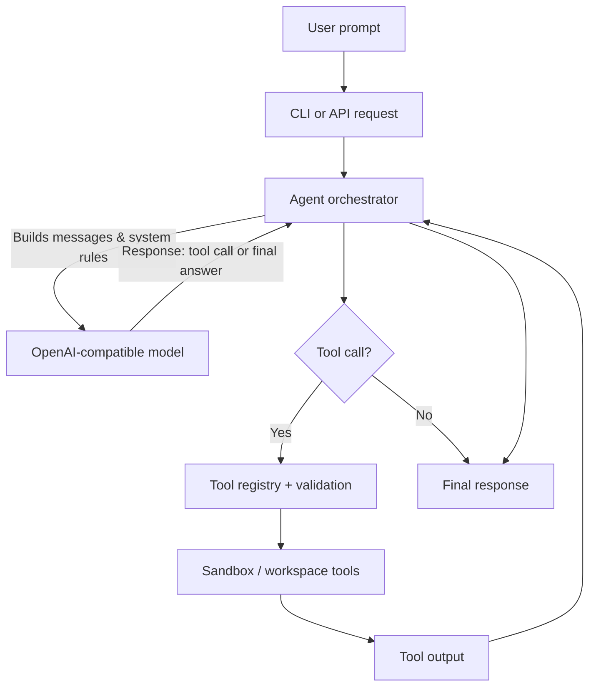

# AgentForge

AgentForge is a production-ready Python 3.11+ repository that implements an agent capable of using tools and creating tools with an OpenAI-compatible model backend.

## Features
- OpenAI-compatible REST client (`/chat/completions`) with configurable base URL.
- Built-in tools: HTTP fetch, workspace filesystem, Python sandbox, deep thinking planner, calculator, regex extract, unit conversion, JSON repair, multi-file code runner.
- Tool registry and validation pipeline for safe tool creation.
- CLI and FastAPI server.
- Eval harness with trace/replay support.

## How the agent works


## Quickstart

### Install
```bash
python -m venv .venv
source .venv/bin/activate
pip install -e .[dev]
```

### Run in mock mode (no API key)
```bash
python -m agentforge "Hello from mock mode"
```

### CLI usage highlights
```bash
python -m agentforge "Draft a release note" --verify --self-consistency 3
```

Common flags:
- `--mode {direct,deep}`: switch between direct and deep planning modes.
- `--allow-tool-creation`: enable tool creation (also available via `ALLOW_TOOL_CREATION=true`).
- `--workspace PATH`: override the workspace directory.
- `--max-steps`, `--max-tool-calls`, `--max-model-calls`: bound the agent loop.
- `--strict-json`, `--code-check`, `--code-check-max-iters`: tighten response formatting and validation.
- `--max-message-chars`, `--max-turns`: control context budgeting.

### Use an OpenAI-compatible base URL
```bash
export OPENAI_API_KEY=sk-your-key
export OPENAI_BASE_URL=https://api.openai.com/v1
export OPENAI_MODEL=gpt-4.1-mini
python -m agentforge "Summarize the weather" --base-url https://api.openai.com/v1
```

#### Local OpenAI-compatible servers
The client accepts a base URL with or without `/v1`:
```bash
export OPENAI_BASE_URL=http://localhost:8000
python -m agentforge "hello"
```
You can also supply extra headers or override the path:
```bash
export OPENAI_EXTRA_HEADERS='{"X-Provider": "local"}'
export OPENAI_FORCE_CHATCOMPLETIONS_PATH=/v1/chat/completions
```

### Start the API
```bash
uvicorn agentforge.api:app --reload
```

## Configuration
Environment variables (CLI flags override env vars):
- `OPENAI_API_KEY` (optional; if missing, mock model is used)
- `OPENAI_BASE_URL` (default `https://api.openai.com/v1`)
- `OPENAI_MODEL` (default `gpt-4.1-mini`)
- `OPENAI_TIMEOUT_SECONDS` (default `30`)
- `OPENAI_EXTRA_HEADERS` (JSON string of headers)
- `OPENAI_DISABLE_TOOL_CHOICE` (default `false`)
- `OPENAI_FORCE_CHATCOMPLETIONS_PATH` (optional override)
- `AGENT_MODE` (default `direct`)
- `ALLOW_TOOL_CREATION` (default `false`)
- `WORKSPACE_DIR` (default `./workspace`)
- `MAX_TOOL_OUTPUT_CHARS` (default `4000`)
- `KEEP_RAW_TOOL_OUTPUT` (default `true`)
- `SUMMARY_LINES` (default `10`)
- `MAX_MODEL_CALLS` (default `20`)
- `MAX_MESSAGE_CHARS` (default `24000`)
- `MAX_TURNS` (default `20`)
- `TRIM_STRATEGY` (default `drop_oldest`)
- `TOOL_VOTE_ENABLED` (default `false`)
- `TOOL_VOTE_K` (default `2`)
- `TOOL_VOTE_MAX_SAMPLES` (default `7`)
- `TOOL_VOTE_MAX_MODEL_CALLS` (default `7`)
- `STRICT_JSON_MODE` (default `false`)
- `CODE_CHECK` (default `false`)
- `CODE_CHECK_MAX_ITERS` (default `2`)
- `SANDBOX_ALLOWED_IMPORTS` (comma-separated allowlist of Python imports)
- `SANDBOX_PASSTHROUGH_ENV` (comma-separated allowlist of extra env vars)

Recommended small-model settings:
```bash
python -m agentforge "Question" --self-consistency 2 --verify --summary-lines 8
```

Additional CLI flags for small-model robustness:
```bash
python -m agentforge "Write code" --strict-json --code-check --max-message-chars 24000 --max-turns 20
```

Strict JSON mode enforces a single JSON object response and retries once on format errors.
Context trimming keeps recent requests and tool summaries within a hard budget, which helps smaller
local models stay focused. Sandbox execution now sanitizes environment variables by default.

## Tool creation gating
Tool creation is disabled by default. Enable it by setting `ALLOW_TOOL_CREATION=true` or using `--allow-tool-creation`. Generated tools are validated with AST-based checks and executed in a sandboxed test process before registration.

## Threat model
AgentForge assumes:
- Untrusted model output: tool code and arguments are validated and sandboxed.
- Tools are confined: filesystem access is limited to the workspace, Python sandbox allows imports only from a small allowlist (configurable via `SANDBOX_ALLOWED_IMPORTS`) and enforces timeouts.
- Network exposure is explicit: only the `http_fetch` tool can perform outbound requests.
- `code_run_multi` executes code in a temporary workspace directory; do not provide secrets or untrusted system commands.
- Secrets are redacted in logs where possible.

## Development
Run tests:
```bash
pytest
```

Run lint:
```bash
ruff check .
```
